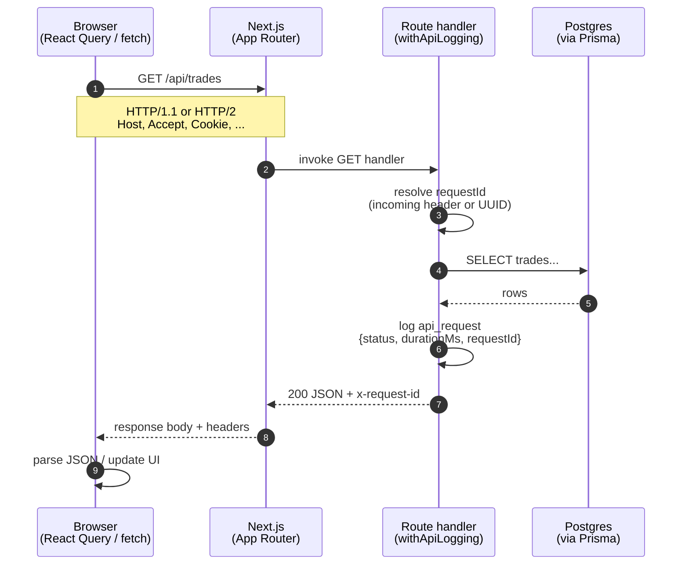

# Request lifecycle (Phase 1)

This note captures why we added API request logging, how a trades request moves through the system, and exercises to build networking intuition.

Ticket: [RDDB-81](https://decodedcreative.atlassian.net/browse/RDDB-81)

## Why this exists

In production you rarely debug by “watching the UI”. You debug by **correlating a single HTTP request** across:

- browser DevTools
- server logs
- (later) database query logs / traces / error trackers

Two primitives unlock that:

| Primitive | Problem it solves |
|---|---|
| **Request ID** (`x-request-id`) | “Which log lines belong to the click I just made?” |
| **Duration** (`durationMs`) | “Was this slow in our handler, or somewhere else?” |

Structured JSON logs (one object per request) are what log platforms index. String-concatenated logs are harder to query.

## What we implemented

`withApiLogging` wraps App Router handlers (`/api/trades`, `/api/trades/[id]`):

1. Read incoming `x-request-id`, or generate a UUID
2. Run the handler (including Prisma / Postgres work)
3. Log `{ msg: "api_request", requestId, method, path, status, durationMs }`
4. Return the response with `x-request-id` set

### Why a route wrapper instead of Next.js `middleware.ts`?

Next.js middleware runs at the **edge**, before your route handler. It is excellent for auth gates, redirects, and attaching IDs early — but it does **not** cleanly measure “handler + DB time”.

This wrapper sits around the handler so `durationMs` includes the work you care about for API performance. Edge middleware is a sensible **next** Phase 1 follow-up (IDs on document navigations, not only `/api/*`).

## Sequence: browser → API → DB → browser

## Where this shows up in a real system

- Support asks “why was trades slow at 14:02?” → filter logs by `path=/api/trades` and sort by `durationMs`
- An error report includes `x-request-id` → search that ID across services
- Later (Phase 5): the same ID becomes the glue between logs, traces, and Sentry events

## Docs to read

- [MDN: HTTP overview](https://developer.mozilla.org/en-US/docs/Web/HTTP/Guides/Overview)
- [MDN: HTTP headers](https://developer.mozilla.org/en-US/docs/Web/HTTP/Reference/Headers)
- [Fetch Standard — Requests & Responses](https://fetch.spec.whatwg.org/#requests)
- [Next.js Route Handlers](https://nextjs.org/docs/app/building-your-application/routing/route-handlers)
- [Next.js Middleware](https://nextjs.org/docs/app/building-your-application/routing/middleware) (compare with our wrapper)

## Investigation exercises (do these yourself)

Do **not** skip these — they are the learning.

1. **DevTools Network**
   - Run `npm run dev`, open `/trades`, find `GET /api/trades`.
   - List every **request** header and every **response** header.
   - For each, write one sentence: what is it for? Who set it (browser, Next, our code, DB proxy)?

2. **Correlate ID ↔ log**
   - Copy `x-request-id` from the response headers.
   - Find the matching `api_request` JSON line in the terminal.
   - Confirm `status` and roughly believable `durationMs`.

3. **Propagate an ID**
   - From DevTools “Copy as fetch”, add `"x-request-id": "manual-test-1"` to the request.
   - Replay it. Does the response echo `manual-test-1`? Does the log?

4. **Status codes**
   - Hit `/api/trades/does-not-exist`. What status do you get? What does the log show?
   - Why is a 404 from our handler different from a failed TCP connection?

5. **Test your understanding** (answer in your own words)
   - What part of end-to-end latency does `durationMs` **not** include?
   - If two users hit `/api/trades` at once, how do you tell their log lines apart?
   - When would you put request ID generation in edge middleware *and* keep this wrapper?

## Debugging drill

Temporarily add `await new Promise((r) => setTimeout(r, 500))` inside the trades handler, reload `/trades`, and watch `durationMs` jump. Remove it. You’ve just simulated a slow dependency — the same signal you’d use in production before reaching for a profiler.
