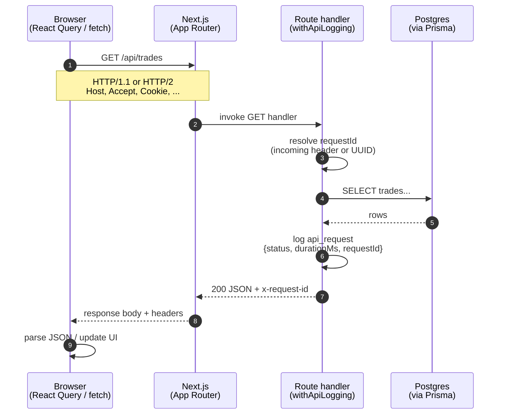

# Request lifecycle (Phase 1)

This note captures why we added API request logging, how a trades request moves through the system, and exercises to build networking intuition.

Ticket: [RDDB-81](https://decodedcreative.atlassian.net/browse/RDDB-81)

## Why this exists

In production you rarely debug by “watching the UI”. You debug by **correlating a single HTTP request** across:

- browser DevTools
- server logs
- (later) database query logs / traces / error trackers

Two primitives unlock that:

| Primitive | Problem it solves |
|---|---|
| **Request ID** (`x-request-id`) | “Which log lines belong to the click I just made?” |
| **Duration** (`durationMs`) | “Was this slow in our handler, or somewhere else?” |

Structured JSON logs (one object per request) are what log platforms index. String-concatenated logs are harder to query.

## What we implemented

`withApiLogging` wraps App Router handlers (`/api/trades`, `/api/trades/[id]`):

1. Read incoming `x-request-id`, or generate a UUID
2. Run the handler (including Prisma / Postgres work)
3. Log `{ msg: "api_request", requestId, method, path, status, durationMs }`
4. Return the response with `x-request-id` set

### Why a route wrapper instead of Next.js `middleware.ts`?

Next.js middleware runs at the **edge**, before your route handler. It is excellent for auth gates, redirects, and attaching IDs early — but it does **not** cleanly measure “handler + DB time”.

This wrapper sits around the handler so `durationMs` includes the work you care about for API performance. Edge middleware is a sensible **next** Phase 1 follow-up (IDs on document navigations, not only `/api/*`).

## Sequence: browser → API → DB → browser



## Where this shows up in a real system

- Support asks “why was trades slow at 14:02?” → filter logs by `path=/api/trades` and sort by `durationMs`
- An error report includes `x-request-id` → search that ID across services
- Later (Phase 5): the same ID becomes the glue between logs, traces, and Sentry events

## Docs to read

- [MDN: HTTP overview](https://developer.mozilla.org/en-US/docs/Web/HTTP/Guides/Overview)
- [MDN: HTTP headers](https://developer.mozilla.org/en-US/docs/Web/HTTP/Reference/Headers)
- [Fetch Standard — Requests & Responses](https://fetch.spec.whatwg.org/#requests)
- [Next.js Route Handlers](https://nextjs.org/docs/app/building-your-application/routing/route-handlers)
- [Next.js Middleware](https://nextjs.org/docs/app/building-your-application/routing/middleware) (compare with our wrapper)

## Investigation exercises

Work through these once. Notes below are a reference, not a substitute for looking at DevTools yourself.

### Gotcha: `/trades` vs `/api/trades`

Visiting `/trades` does **not** call `GET /api/trades` on first load. The page SSR-fetches via Prisma (`getTradesFromDb`) and seeds React Query with `initialData` + a 60s `staleTime`.

To inspect the API in Network: open `/trades`, then run `fetch('/api/trades')` in the Console (or wait for a client refetch). Confirm **Request URL** is `http://localhost:3000/api/trades` — not the HTML document and not a Next RSC flight named `trades`.

### 1. DevTools Network

- Run `npm run dev`, trigger `GET /api/trades`, list request + response headers.
- For each: what is it for? Who set it (browser, Next/Node, our code)?

#### Headers worth remembering (debugging)

| Header | Direction | Who | Why it matters |
|---|---|---|---|
| `Cookie` | request | Browser sends; Next set the HMR cookie in dev | Auth/session in real apps |
| `Content-Type` | response | Next (`NextResponse.json`) | Is the body JSON or an HTML error page? |
| `x-request-id` | response (and request if client sends it) | **Our** `withApiLogging` | Correlate DevTools ↔ `api_request` logs |
| Status code | — | Our handler / Next | Paired with the above; not a header but essential |

Also useful sometimes: `Accept` / `Authorization` (request), `Cache-Control` / `Set-Cookie` / `Vary` (response).

#### Other request headers (browser — usually noise)

| Header | One-liner |
|---|---|
| `Accept: */*` | Client will accept any response MIME type |
| `Accept-Encoding` | Compression the browser understands (gzip, br, …) |
| `Accept-Language` | Preferred language |
| `Connection: keep-alive` | Prefer a persistent HTTP/1.1 connection |
| `Host` | Target host:port |
| `Referer` | Document URL that initiated the fetch (e.g. `/trades`) |
| `Sec-Fetch-Dest: empty` | Not a navigable document/image/script — typical for `fetch` |
| `Sec-Fetch-Mode: cors` | How the request was made (`cors` is fetch’s default, even same-origin) |
| `Sec-Fetch-Site: same-origin` | Same origin as the document |
| `User-Agent` / `sec-ch-ua*` | Browser / OS identity hints |

#### Other response headers (Next/Node — usually noise)

| Header | One-liner |
|---|---|
| `Connection` / `Keep-Alive` | Connection reuse hints from the HTTP server |
| `Date` | When the response was generated |
| `Transfer-Encoding: chunked` | Body sent in chunks (no `Content-Length`) |
| `Vary: rsc, next-router-…` | Next App Router cache/content-negotiation keys |

### 2. Correlate ID ↔ log

Copy `x-request-id` from the response → find the matching `api_request` JSON line → check `status` and a believable `durationMs`.

Example observations:

- `requestId=f15d6946-…`, `status=200`, `durationMs≈119` — warm local hit
- `requestId=d3caec1b-…`, `status=200`, `durationMs≈833` — still fine (cold DB / machine load); worry when timings are absurd for the work done

### 3. Propagate an ID

From Console (or Copy as fetch), send a client id:

```js
const res = await fetch('/api/trades', {
  headers: { 'x-request-id': 'manual-test-1' },
});
console.log(res.headers.get('x-request-id')); // → manual-test-1
```

The response and the `api_request` log both echo `manual-test-1` (wrapper reuses an incoming id instead of minting a UUID). `Promise {<pending>}` in the Console only means you didn’t `await` — check Network/logs either way.

### 4. Status codes

- `GET /api/trades/does-not-exist` → **404** from **our** handler (`Trade not found`). Route `/api/trades/[id]` matched; the trade id did not. Log: `api_request` with `status: 404` and an `x-request-id`.
- **404 vs failed TCP:** 404 means TCP connected and HTTP finished — you still get status, headers, body, and a log. Failed TCP (server down, `ERR_CONNECTION_REFUSED`) never reaches the handler — no HTTP status, no `x-request-id`, no `api_request` line.

### 5. Test your understanding

- **`durationMs` does not include:** browser ↔ server network time, or work after the response (parse JSON, paint). It only times handler + DB inside `withApiLogging`.
- **Two users at once:** each request has its own `requestId` — filter logs by that field.
- **Middleware + wrapper:** middleware mints/attaches an id early for *all* requests (including page navigations). Wrapper still measures API handler/DB time and writes `api_request`. Use both when you want IDs everywhere *and* accurate API timings.

## Debugging drill

1. Temporarily add `await new Promise((r) => setTimeout(r, 500))` inside `src/app/api/trades/route.ts` (the `GET` handler wrapped by `withApiLogging`).
2. Trigger `GET /api/trades` (Console `fetch` — reloading `/trades` alone won’t hit this route).
3. Watch `durationMs` jump by ~500ms+. Next’s `GET /api/trades 200 in …ms` may be slightly higher (overhead outside the wrapper).
4. Remove the delay. You’ve simulated a slow dependency — the same signal you’d use in production before reaching for a profiler.
